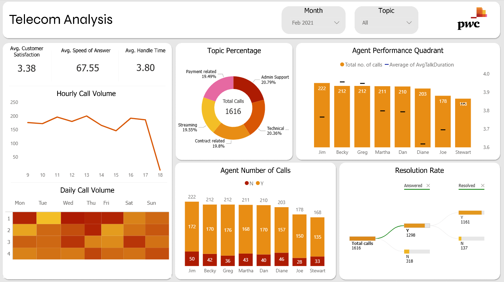

# PwC Upskilling Program - Data Analysis Projects

This repository contains three data analysis projects completed as part of the PwC Upskilling Program offered through Forage. Each project focuses on data analysis skills using Power BI for visualization and interpretation.

## Table of Contents

1. [Overview](#overview)
2. [Projects](#projects)
    - [Task 1: Telecom Analysis](#task-1-telecom-analysis)
    - [Task 2: Churn Analysis](#task-2-churn-analysis)
    - [Task 3: Diversity and Inclusion](#task-3-diversity-and-inclusion)
3. [Technologies Used](#technologies-used)

## Overview

This repository showcases work completed for the PwC Upskilling Program via Forage.

## Projects

### Task 1: Telecom Analysis

-   **Description**: Analyzed telecom customer data to uncover patterns in purchasing behavior and service usage.
-   **Folder**: `/Task-1-Telecom-Analysis`
-   **Key Files**:
    -   `Telecom Analysis.pbix`: Power BI file with analysis and visualizations.
-   **Objective**: Identify trends in customer behavior to inform business strategies.
    

### Task 2: Churn Analysis

-   **Description**: Visualized customer churn data to identify factors contributing to retention and loss.
-   **Folder**: `/Task-2-Churn-Analysis`
-   **Key Files**:
    -   `Churn Analysis.pbix`: Power BI file with analysis and visualizations.
-   **Objective**: Create dashboards to track churn metrics and support decision-making.
    

### Task 3: Diversity and Inclusion

-   **Description**: Analyzed workforce data to assess diversity and inclusion metrics.
-   **Folder**: `/Task-3-Diversity-and-Inclusion`
-   **Key Files**:
    -   `Diversity & Inclusion Analysis.pbix`: Power BI file with analysis and visualizations.
-   **Objective**: Evaluate diversity metrics and propose inclusion strategies.
    

## Technologies Used

-   **Power BI**: For data visualization and analysis.
-   **Excel/CSV**: For handling sample datasets .
